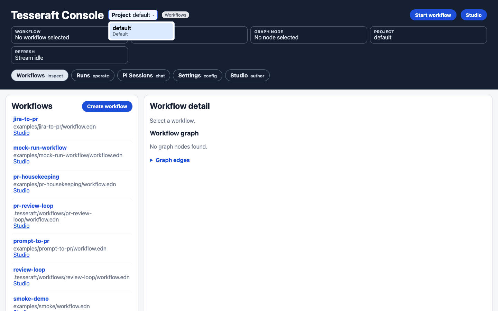
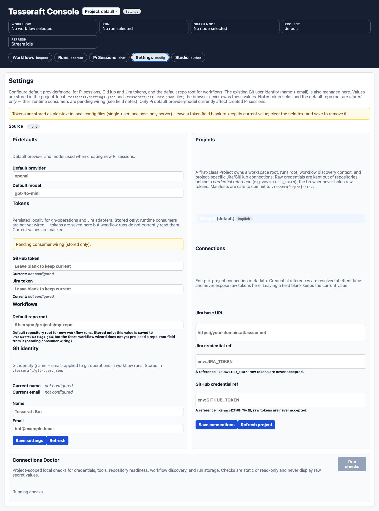
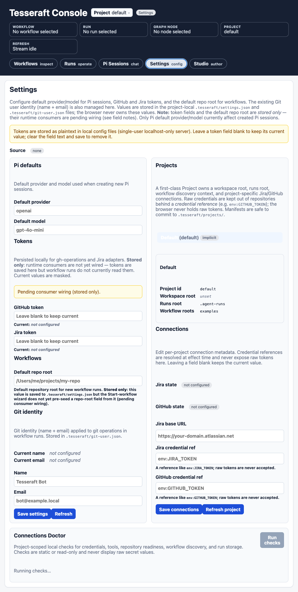
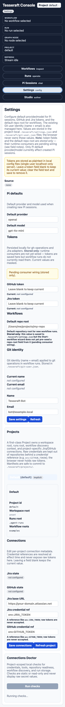
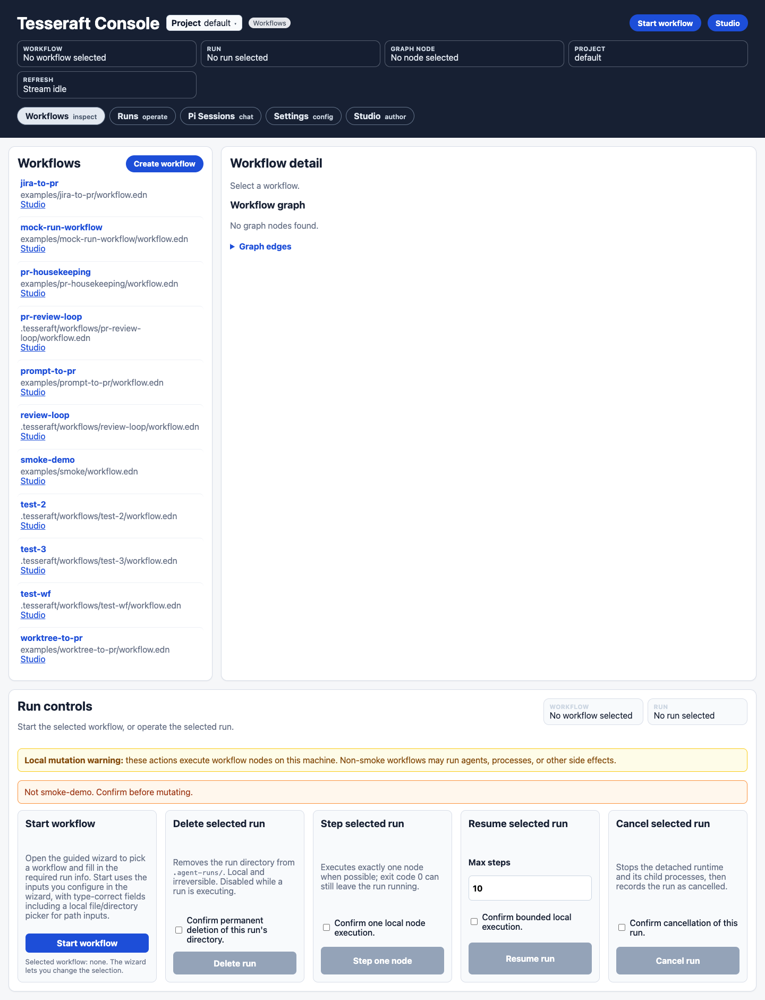

# UI quality-gate evidence

Rendered from the worktree-rooted Tesseraft server. The machine-readable measurements and checks are in [`ui-evidence-1.json`](ui-evidence-1.json).

## Project menu open

The project picker escapes the header's layout and remains visible and pointer-targetable.

## Desktop Settings

The primary settings and project/connections panels share the available width; Connections Doctor spans the page below them.

## Compact Settings

The two-column layout remains usable at 1024×768.

## Mobile Settings

The settings panels collapse into one column at 390×844 without horizontal overflow.

## Desktop baseline

